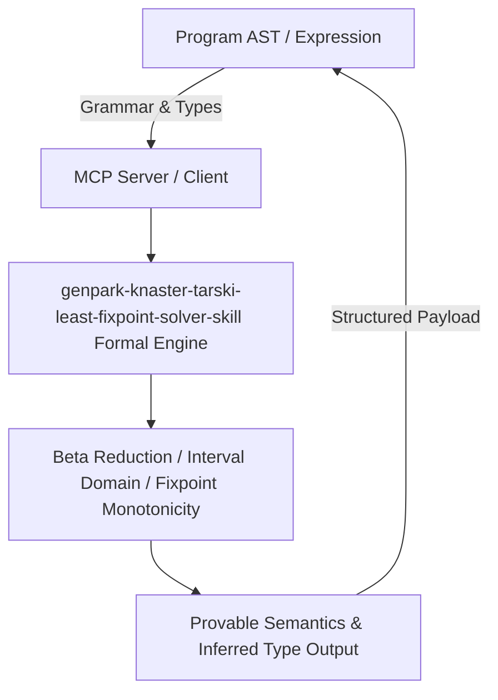

# genpark-knaster-tarski-least-fixpoint-solver-skill

[](https://github.com/Alpha-Park/genpark-knaster-tarski-least-fixpoint-solver-skill)
[](https://python.org)
[](#)
[](#)
[](LICENSE)

> Knaster-Tarski least fixpoint iterative solver computing greatest lower bounds and invariant convergence over complete finite lattices.

## Architecture Overview



## Features
- **0 External Pip Dependencies**: Pure Python standard library implementation.
- **MCP Protocol Ready**: Includes Model Context Protocol server script (`mcp_server.py`).
- **Production Standard**: Mathematical proof consistency and robust boundary verification.

## Quick Start
```bash
python example_usage.py
```
